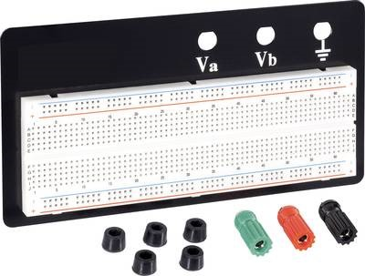
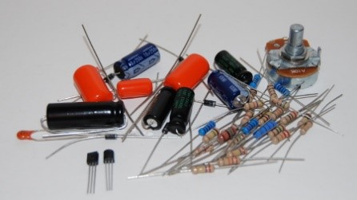
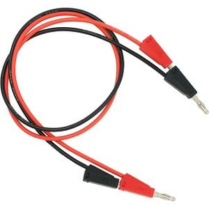


---

## Week 1

Maak van alle hardware die je op het breadboard van de Boebot zet zowel een elektrisch schema als een foto voor referentie. Neem de foto en schema  in je groeidocument op.

### Opdrachten BoeBot





{: .exercises }

### Opdrachten meten

Voor de opdrachten hierna heb je de extra Hardware kit nodig.  De Hardware kit bestaat uit een 
Breadboard, componenten en meetsnoeren:

De weerstanden onder de componenten zijn van de E12 reeks:
10-12-15-18-22-27-33-39-47-56-68-82
Hier kan dan nog de toevoeging K (x103) of M (x106) op toegepast worden.

*Dit materiaal wordt aan de uitleenbalie verstrekt op vertoon van je collegekaart. Let wel op dat het materiaal aan het eind van de periode weer ingeleverd moet worden en tot die tijd ben je er verantwoordelijk voor.*




{: .exercises }
